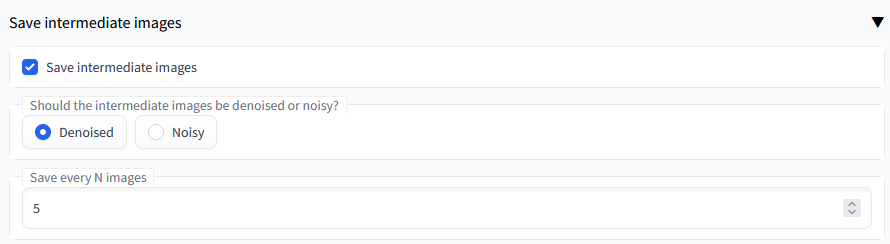

# Stable Diffusion Save intermediate images extension 

A custom extension for [AUTOMATIC1111/stable-diffusion-webui](https://github.com/AUTOMATIC1111/stable-diffusion-webui) that implements saving intermediate images.

## Installation

The extension can be installed directly from within the **Extensions** tab within the Webui

You can also install it manually by running the following command from within the webui directory:

	git clone https://github.com/AlUlkesh/sd_save_intermediate_images/ extensions/sd_save_intermediate_images

## To-do
Support DDIM and PLMS
