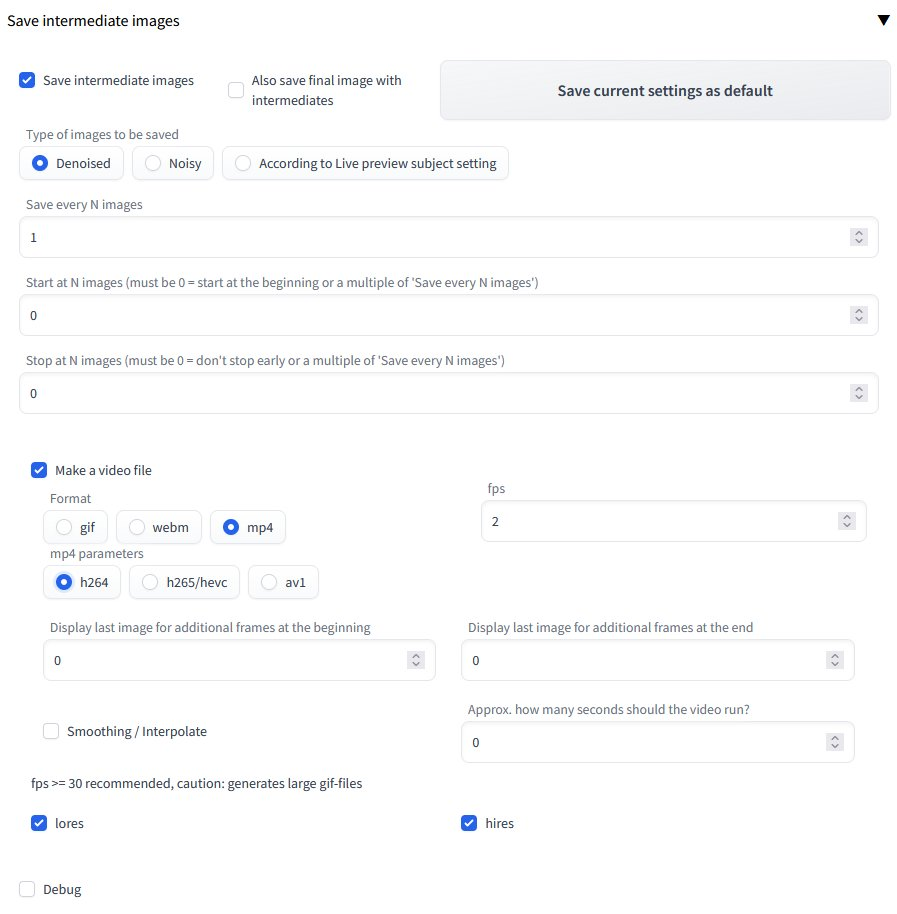

# Stable Diffusion Save intermediate images extension 

A custom extension for [AUTOMATIC1111/stable-diffusion-webui](https://github.com/AUTOMATIC1111/stable-diffusion-webui) that implements saving intermediate images.

## Installation

The extension can be installed directly from within the **Extensions** tab within the Webui.

You can also install it manually by running the following command from within the webui directory:

	git clone https://github.com/AlUlkesh/sd_save_intermediate_images/ extensions/sd_save_intermediate_images

## Samplers
Works with all a1111 samplers

## Output

Once the image generation begins, the intermediate images will start saving in a directory under a new \outputs\(*txt2img or img2img*)-images\intermediates directory.

Please be aware that **Image creation progress preview mode** in the webui's settings affects how and especially at what size the intermediate images are created.

You can also make a video out of the intermediate images:

GIF: 

MP4, with interpolation: 
<video src='https://user-images.githubusercontent.com/99896447/213034519-7b6ed42f-39d5-4994-a8b7-c85ec92bda84.mp4' autoplay loop></video>

## Requirements
For video generation ffmpeg needs to be in your path.

General information about ffmpeg downloads:
https://ffmpeg.org/download.html

For Windows it probably is easiest to download one of the release packages:
https://www.gyan.dev/ffmpeg/builds/#release-builds

unpack it whereever you want and then put the path to the bin folder in your path environment variable.
